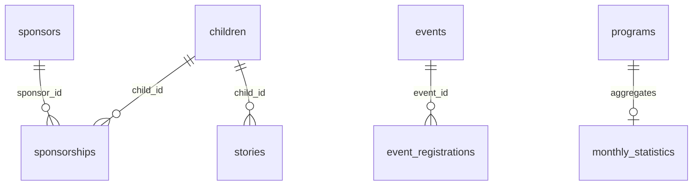
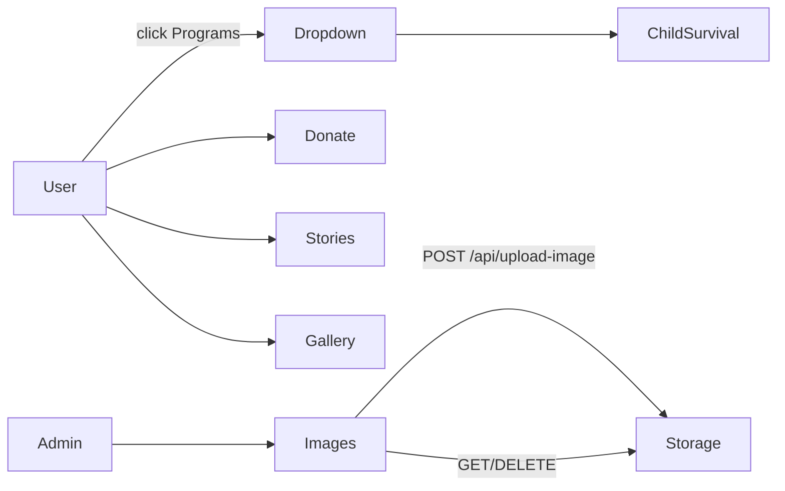
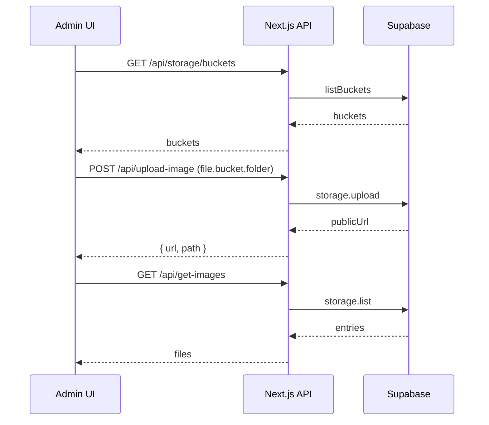

# KE 258 Lwanda CDC — Full Website Documentation

> Version: v1.0 • Date: 2025-12-01 • Maintainers: KE 258 Lwanda CDC Tech Team

## Project Summary
The KE 258 Lwanda Child Development Centre website is a production‑ready Next.js 14 (App Router) application using React 19, TypeScript, and Tailwind CSS v4. It delivers a public site for program storytelling and community engagement, and an Admin area for asset management integrated with Supabase (Postgres + Storage). The codebase favors server components with minimal client JS, branded design tokens, and secure image handling via Supabase Storage with admin‑authenticated API routes.

## Table of Contents
- JSON Manifest
- Site Map
- Pages & Workflows
- Components Index
- UI Layout & Theming
- Frontend Architecture
- Backend Architecture
- Database (Supabase)
- Storage & Auth (Supabase)
- Admin Flows
- Deployment & Environment
- File‑Level Index
- API Reference
- Diagrams (Mermaid)
- Troubleshooting
- Verification Checklist

---

## JSON Manifest

<details><summary>manifest.json</summary>

```json
{
  "framework": {
    "name": "next",
    "version": "14.2.25",
    "react": "19",
    "typescript": true,
    "tailwind": "4.1.9"
  },
  "packages": {
    "supabase": "@supabase/supabase-js@^2.84.0",
    "radix": [
      "@radix-ui/react-label", "@radix-ui/react-dialog"
    ],
    "ui": ["next-themes", "lucide-react"]
  },
  "scripts": {
    "dev": "next dev",
    "build": "next build",
    "start": "next start",
    "lint": "eslint .",
    "capture": "node scripts/capture-screenshots.mjs"
  },
  "routes": {
    "user": [
      { "path": "/", "file": "app/page.tsx", "export": "HomePage" },
      { "path": "/about", "file": "app/about/page.tsx", "export": "AboutPage" },
      { "path": "/programs", "file": "app/programs/page.tsx", "export": "ProgramsPage" },
      { "path": "/programs/child-survival", "file": "app/programs/child-survival/page.tsx", "export": "ChildSurvivalPage" },
      { "path": "/programs/sponsorship", "file": "app/programs/sponsorship/page.tsx", "export": "SponsorshipPage" },
      { "path": "/programs/youth-development", "file": "app/programs/youth-development/page.tsx", "export": "YouthDevelopmentPage" },
      { "path": "/get-involved", "file": "app/get-involved/page.tsx", "export": "GetInvolvedPage" },
      { "path": "/stories", "file": "app/stories/page.tsx", "export": "StoriesPage" },
      { "path": "/gallery", "file": "app/gallery/page.tsx", "export": "Gallery" },
      { "path": "/events", "file": "app/events/page.tsx", "export": "EventsPage" },
      { "path": "/contact", "file": "app/contact/page.tsx", "export": "ContactPage" },
      { "path": "/donate", "file": "app/donate/page.tsx", "export": "DonatePage" },
      { "path": "/faq", "file": "app/faq/page.tsx", "export": "FAQPage" },
      { "path": "/reports", "file": "app/reports/page.tsx", "export": "ReportsPage" },
      { "path": "/privacy", "file": "app/privacy/page.tsx", "export": "PrivacyPage" },
      { "path": "/terms", "file": "app/terms/page.tsx", "export": "TermsPage" },
      { "path": "/safeguarding", "file": "app/safeguarding/page.tsx", "export": "SafeguardingPage" },
      { "path": "/upload", "file": "app/upload/page.tsx", "export": "UserUploadPage" }
    ],
    "admin": [
      { "path": "/admin", "file": "app/admin/page.tsx", "export": "AdminDashboard" },
      { "path": "/admin/images", "file": "app/admin/images/page.tsx", "export": "ImageManagementPage" },
      { "path": "/admin/content", "file": "app/admin/content/page.tsx", "export": "ContentManagement" },
      { "path": "/admin/settings", "file": "app/admin/settings/page.tsx", "export": "SettingsPage" }
    ],
    "api": [
      { "path": "/api/upload", "file": "app/api/upload/route.ts", "method": "POST" },
      { "path": "/api/upload-image", "file": "app/api/upload-image/route.ts", "method": "POST" },
      { "path": "/api/get-images", "file": "app/api/get-images/route.ts", "method": "GET" },
      { "path": "/api/delete-image", "file": "app/api/delete-image/route.ts", "method": "DELETE" },
      { "path": "/api/images/list", "file": "app/api/images/list/route.ts", "method": "GET" },
      { "path": "/api/images/delete", "file": "app/api/images/delete/route.ts", "method": "DELETE" },
      { "path": "/api/images/record", "file": "app/api/images/record/route.ts", "method": "POST" },
      { "path": "/api/images/sign", "file": "app/api/images/sign/route.ts", "method": "GET" },
      { "path": "/api/storage/buckets", "file": "app/api/storage/buckets/route.ts", "method": "GET" },
      { "path": "/api/storage/folders", "file": "app/api/storage/folders/route.ts", "method": "GET" },
      { "path": "/api/storage/signed-upload", "file": "app/api/storage/signed-upload/route.ts", "method": "POST" }
    ]
  },
  "env": [
    "NEXT_PUBLIC_SUPABASE_URL",
    "NEXT_PUBLIC_SUPABASE_ANON_KEY",
    "SUPABASE_SERVICE_ROLE_KEY",
    "NEXT_PUBLIC_HERO_BUCKET",
    "NEXT_PUBLIC_GALLERY_BUCKET",
    "NEXT_PUBLIC_SITE_URL"
  ],
  "directories": ["app", "components", "lib", "public", "scripts", "docs", "styles"]
}
```

</details>

---

## Site Map

```mermaid
graph TD
  Home[/]/
  About[/about]
  Programs[/programs]
  ChildSurvival[/programs/child-survival]
  Sponsorship[/programs/sponsorship]
  YouthDev[/programs/youth-development]
  GetInvolved[/get-involved]
  Stories[/stories]
  Gallery[/gallery]
  Events[/events]
  Contact[/contact]
  Donate[/donate]
  FAQ[/faq]
  Reports[/reports]
  Privacy[/privacy]
  Terms[/terms]
  Safeguarding[/safeguarding]
  Upload[/upload]
  Admin[/admin]
  AdminImages[/admin/images]
  AdminContent[/admin/content]
  AdminSettings[/admin/settings]
  Home-->Programs
  Programs-->ChildSurvival
  Programs-->Sponsorship
  Programs-->YouthDev
  Home-->Stories
  Home-->Gallery
  Home-->Donate
  Home-->GetInvolved
  Admin-->AdminImages
  Admin-->AdminContent
  Admin-->AdminSettings
```

---

## Pages & Workflows

- Home `app/page.tsx`
  - Purpose: Landing page with hero, stats, programs, stories, partners, CTAs.
  - Data: Supabase `stories` for latest items; Supabase Storage for hero image bucket `process.env.NEXT_PUBLIC_HERO_BUCKET`.
  - Components: `SiteHeader`, `HeroSection`, `StatCard`, `ProgramCard`, `StoryCard`, `CtaBanner`, `NewsletterSignup`, `SiteFooter`.
  - Lifecycle: Server component; fetches stories and hero image URLs on render; images via `storage.getPublicUrl`.
  - Excerpt: `app/page.tsx:12–16` → `export default async function HomePage() { const supabase = getSupabase() ... }`

- About `app/about/page.tsx`
  - Purpose: Mission, vision, values, leadership, partnerships.
  - Components: `SiteHeader`, `HeroSection`, `CtaBanner`, `SiteFooter`.
  - Excerpt: `app/about/page.tsx:7–13` → `export default function AboutPage() { ... <HeroSection title="Our Story" ... /> }`

- Programs `app/programs/page.tsx`
  - Purpose: Overview with stats and links to three program detail pages.
  - Components: `HeroSection`, `StatCard`, `ProgramCard`, `CtaBanner`.
  - Excerpt: `app/programs/page.tsx:9–16` → `export default function ProgramsPage() { ... }`

- Program Details
  - Child Survival `app/programs/child-survival/page.tsx` → static content layout.
  - Sponsorship `app/programs/sponsorship/page.tsx` → static content layout.
  - Youth Development `app/programs/youth-development/page.tsx` → static content layout.
  - Excerpt: e.g., `app/programs/child-survival/page.tsx:8` → `export default function ChildSurvivalPage() { ... }`

- Stories `app/stories/page.tsx`
  - Purpose: Paginated published stories grid with newsletter signup.
  - Data: Supabase `stories` table; `is_published=true`, `range(from,to)` by `page` query.
  - Excerpt: `app/stories/page.tsx:7–17` → `export default async function StoriesPage({ searchParams } ... select("title, content, story_date, tag, images, is_published") ... )`

- Events `app/events/page.tsx`
  - Purpose: Upcoming and recent events with dates, time, location, media.
  - Data: Supabase `events`; public URLs for media via `storage.from("gallery").getPublicUrl`.
  - Excerpt: `app/events/page.tsx:6–14` → `export default async function EventsPage() { const res = await supabase.from("events").select(...) }`

- Gallery `app/gallery/page.tsx`
  - Purpose: Dynamic grid of images from Supabase Storage with search and modal viewer.
  - Data: Supabase storage `list` with `NEXT_PUBLIC_GALLERY_BUCKET`.
  - Excerpt: `app/gallery/page.tsx:24–31` → `const { data } = await supabase.storage.from(bucket).list("", { recursive: true }) ...`

- Get Involved, Donate, Contact, FAQ, Reports, Privacy, Terms, Safeguarding
  - Purpose: Informational pages composed of header/hero/content/footer; FAQ includes accordion interactions.
  - Excerpts: `app/faq/page.tsx:33–41` → `export default function FAQPage() { const faqs = [...] }`

- Upload (User) `app/upload/page.tsx`
  - Purpose: Public image upload utility to selected bucket/folder.
  - Data: Buckets/folders via internal APIs; upload via Supabase Storage from client.
  - Excerpt: `app/upload/page.tsx:12` → `export default function UserUploadPage() { ... }`

- Admin Area
  - Layout `app/admin/layout.tsx` → header + sidebar nav; wraps child pages.
  - Dashboard `app/admin/page.tsx` → cards and activity feed.
    - Excerpt: `app/admin/page.tsx:4–10` → `export default function AdminDashboard() { const stats = [...] }`
  - Images `app/admin/images/page.tsx` → bucket/folder tabs, uploader, gallery, selection dialog; admin role required for POST/DELETE.
    - Excerpt: `app/admin/images/page.tsx:27` → `export default function ImageManagementPage() { ... }`
  - Content `app/admin/content/page.tsx` → scaffold for content management (static placeholder).
  - Settings `app/admin/settings/page.tsx` → settings scaffold.

---

## Components Index

- Global
  - `components/site-header.tsx` → sticky header with mobile menu and Programs dropdown.
    - Excerpt: `components/site-header.tsx:8–13` → `export function SiteHeader() { const [isMenuOpen, setIsMenuOpen] = useState(false) ... }`
    - Props: none (stateful client component).
  - `components/site-footer.tsx` → footer with partner badges, quick links, contact.
    - Excerpt: `components/site-footer.tsx:5–9` → `export function SiteFooter() { return (<footer ...>) }`

- Sections
  - `components/sections/hero-section.tsx` → Props `{ title, subtitle, description?, primaryCta?, secondaryCta?, backgroundImage? }`.
    - Excerpt: `components/sections/hero-section.tsx:19–27` → `export function HeroSection({ title, subtitle, ... }: HeroSectionProps) { ... }`
  - `components/sections/cta-banner.tsx` → Props `{ title, description, primaryCta, secondaryCta?, variant? }`.

- UI Primitives (`components/ui/*`)
  - `button.tsx` → `Button` with `variant` and `size` props.
  - `card.tsx` → `Card` and compound parts.
  - `input.tsx` → `Input` text field.
  - `label.tsx` → `Label` (Radix Label).
  - `dialog.tsx` → `Dialog` components.
  - `badge.tsx`, `program-card.tsx`, `stat-card.tsx`, `story-card.tsx`.

- Admin
  - `components/admin/image-uploader.tsx` → file selection, preview, authenticated upload via `/api/upload-image`.
  - `components/admin/image-gallery.tsx` → bucket/folder filter, list, copy URL, delete via `/api/delete-image`.

- Icons
  - `components/icons.tsx` → SVG icon exports used across the UI.

---

## UI Layout & Theming

- Layout
  - Root `app/layout.tsx` sets fonts (`Inter`, `Manrope`) and metadata; wraps `<html><body>{children}</body>`.
  - Admin shell `app/admin/layout.tsx` provides header and sidebar navigation.

- Styles & Tokens
  - `app/globals.css` defines OKLCH color tokens, radii, Tailwind v4 theme mapping, base styles, and `.btn-*` utilities.
  - Dark mode tokens defined under `.dark` class; optional `components/theme-provider.tsx` with `next-themes`.

- Animations
  - Tailwind animate via `tw-animate-css`; minimal usage in mobile nav.

- Performance Notes
  - SSR by default; images mostly regular `` with public URLs; consider `next/image` for optimization on public pages.

---

## Frontend Architecture

- Framework/Version
  - Next.js 14 App Router; React 19; TypeScript; Tailwind CSS v4.

- Routing Strategy
  - File‑system routes in `app/*/page.tsx`; API in `app/api/**/route.ts`.

- State Management
  - Local component state (`useState`) for interactive pieces (header menu, forms, admin tools). No global store.

- Build Commands
  - `pnpm dev`, `pnpm build`, `pnpm start`, `pnpm lint`.

- Environment Variables
  - `NEXT_PUBLIC_SUPABASE_URL`, `NEXT_PUBLIC_SUPABASE_ANON_KEY`, `SUPABASE_SERVICE_ROLE_KEY`, `NEXT_PUBLIC_HERO_BUCKET`, `NEXT_PUBLIC_GALLERY_BUCKET`, `NEXT_PUBLIC_SITE_URL`.

- Directory Structure
  - `app/` routes and global layout/styles.
  - `components/` reusable UI and sections.
  - `lib/` utilities and Supabase client.
  - `scripts/` SQL and tooling.
  - `docs/` internal documentation.
  - `public/` static assets.

- Client‑Side Workflows
  - Forms: newsletter uses simple client submission with temporal feedback.
  - Validation: file type/size checks in uploaders; image dimension checks.
  - Error UI: descriptive messages shown in admin/user upload interfaces.
  - Loading states: gallery and admin lists show loading placeholders.
  - Accessibility: semantic labels; focus ring tokens; improve ARIA for dropdown/dialog if needed.

---

## Backend Architecture

- Server Framework
  - Next.js API Routes under `app/api/**` (serverless handlers).

- Folder Layout & Mapping
  - Storage APIs: `/api/storage/buckets`, `/api/storage/folders`, `/api/storage/signed-upload`.
  - Image APIs: `/api/upload`, `/api/upload-image`, `/api/get-images`, `/api/delete-image`, `/api/images/*`.

- Middleware & Auth
  - Admin endpoints validate Supabase user token and role `admin` using `SUPABASE_SERVICE_ROLE_KEY`.
  - Basic IP rate limiting on `/api/upload`.

- Background Jobs
  - None in repo; monthly stats can be updated via SQL (see DB section). Cron recommended in future.

---

## Database (Supabase)

- DDL Source: `scripts/supabase/001-create-tables.sql` (full schema), `002-row-level-security.sql`, `003-seed-data.sql`.

- Tables Overview
  - `children`, `sponsors`, `sponsorships`, `donations`, `events`, `event_registrations`, `gallery_items`, `stories`, `contact_submissions`, `newsletter_subscriptions`, `volunteer_applications`, `programs`, `monthly_statistics`.

- Keys & Constraints
  - UUID primary keys; unique fields like `registration_number`, `slug`, `email`.
  - Foreign keys: `sponsorships.child_id → children.id`, `sponsorships.sponsor_id → sponsors.id`, `event_registrations.event_id → events.id`.

- Indexes
  - Created on status/date/category/foreign keys for performance.

- Sample Rows
  - See `scripts/supabase/003-seed-data.sql` for inserts across key tables.

- ER Description



---

## Storage & Auth (Supabase)

- Buckets
  - Recommended: `gallery`, `children-photos`, `events`, `stories` (see docs/SUPABASE_DATABASE.md instructions).

- Policies
  - RLS enabled on all tables; public SELECT on published content; INSERT open for contact/newsletter/volunteer/events/donations; `admin` role full CRUD.

- Admin Role
  - User metadata must include `{ role: "admin" }`; service role key used server‑side to validate.

---

## Admin Flows

- Image Upload (Admin)
  - UI: `app/admin/images/page.tsx` + `components/admin/*`.
  - Server: `POST /api/upload-image` (Bearer token → Supabase auth → upload to bucket/folder → return public URL).

- Image List/Delete (Admin)
  - `GET /api/get-images` lists files with transformed public URLs.
  - `DELETE /api/delete-image` removes objects from storage.

- Content Recording (optional)
  - `POST /api/images/record` inserts `gallery_items` rows (non‑blocking warning on error).

---

## Deployment & Environment

- Local Setup
  - Clone and install: `pnpm install`.
  - Copy env: create `.env.local` from `.env.example`.
  - Set Supabase project envs (URL, anon key, service role).
  - Optional: run SQL DDL and RLS in Supabase dashboard; seed data.
  - Start: `pnpm dev` → http://localhost:3000/

- CI/CD (example)
  - Build: `pnpm install --frozen-lockfile && pnpm build`.
  - Test: add unit/integration tests (future); block merges on failures.
  - Env: configure project env vars in hosting provider (Vercel/Trae server).

- Environment Variables (`.env.example`)

```env
NEXT_PUBLIC_SUPABASE_URL=
NEXT_PUBLIC_SUPABASE_ANON_KEY=
SUPABASE_SERVICE_ROLE_KEY=
NEXT_PUBLIC_HERO_BUCKET=hero
NEXT_PUBLIC_GALLERY_BUCKET=gallery
NEXT_PUBLIC_SITE_URL=http://localhost:3000
```

- Usage Locations
  - `lib/supabase/client.ts:7–12` uses `NEXT_PUBLIC_SUPABASE_URL`, `NEXT_PUBLIC_SUPABASE_ANON_KEY`.
  - `app/page.tsx:24` uses `NEXT_PUBLIC_HERO_BUCKET`.
  - `app/gallery/page.tsx:24` uses `NEXT_PUBLIC_GALLERY_BUCKET`.
  - `app/api/*` routes use `SUPABASE_SERVICE_ROLE_KEY`, `NEXT_PUBLIC_SUPABASE_URL`, and `NEXT_PUBLIC_SITE_URL`.

---

## File‑Level Index

- `app/layout.tsx` — Root HTML layout and font variables. Exports: `RootLayout`.
- `app/globals.css` — Global tokens and Tailwind theme mapping.
- `app/page.tsx` — Home page SSR. Exports: `HomePage`.
- `app/about/page.tsx` — About page. Exports: `AboutPage`.
- `app/programs/page.tsx` — Programs overview. Exports: `ProgramsPage`.
- `app/programs/*/page.tsx` — Program detail pages. Exports: `ChildSurvivalPage`, `SponsorshipPage`, `YouthDevelopmentPage`.
- `app/stories/page.tsx` — Published stories grid. Exports: `StoriesPage`.
- `app/events/page.tsx` — Events listing. Exports: `EventsPage`.
- `app/gallery/page.tsx` — Gallery grid (client). Exports: `Gallery`.
- `app/get-involved/page.tsx` — Engagement options. Exports: `GetInvolvedPage`.
- `app/donate/page.tsx` — Donation page scaffold. Exports: `DonatePage`.
- `app/contact/page.tsx` — Contact form. Exports: `ContactPage`.
- `app/faq/page.tsx` — FAQ accordion. Exports: `FAQPage`.
- `app/reports/page.tsx` — Reports page. Exports: `ReportsPage`.
- `app/privacy/page.tsx` — Privacy policy. Exports: `PrivacyPage`.
- `app/terms/page.tsx` — Terms of service. Exports: `TermsPage`.
- `app/safeguarding/page.tsx` — Safeguarding policy. Exports: `SafeguardingPage`.
- `app/upload/page.tsx` — User upload (client). Exports: `UserUploadPage`.
- `app/admin/layout.tsx` — Admin shell. Exports: `AdminLayout`.
- `app/admin/page.tsx` — Admin dashboard. Exports: `AdminDashboard`.
- `app/admin/images/page.tsx` — Admin images. Exports: `ImageManagementPage`.
- `app/admin/content/page.tsx` — Content management scaffold. Exports: `ContentManagement`.
- `app/admin/settings/page.tsx` — Settings scaffold. Exports: `SettingsPage`.
- `app/api/*/route.ts` — API handlers; see API Reference.
- `components/*` — UI components; see Components Index.
- `lib/supabase/client.ts` — Supabase client factory. Exports: `getSupabase`.
- `lib/supabase/types.ts` — Generated DB types.
- `lib/utils.ts` — `cn`, `cva`, `VariantProps`.
- `scripts/supabase/*.sql` — DDL, RLS, seed scripts.
- `docs/*` — Prior documentation and screenshots.

---

## API Reference

- Upload (public, rate‑limited)
  - `POST /api/upload` (`app/api/upload/route.ts`)
  - Request: multipart/form‑data (`file`, `bucket`, `folder`, `userId`) and Origin must match `NEXT_PUBLIC_SITE_URL`.
  - Response example:

```json
{
  "url": "https://.../gallery/ke258/general/anonymous/1733020000000-abc123-image.jpg",
  "bucket": "gallery",
  "path": "ke258/general/anonymous/1733020000000-abc123-image.jpg",
  "filename": "image.jpg",
  "size": 123456,
  "type": "image/jpeg",
  "uploadedAt": "2025-12-01T10:00:00.000Z",
  "width": 1200,
  "height": 800,
  "userId": "anonymous"
}
```

- Upload (admin only)
  - `POST /api/upload-image` (`app/api/upload-image/route.ts`) with `Authorization: Bearer <token>`.
  - Response: `{ url, bucket, path, size, type }`.

- List Images (admin)
  - `GET /api/get-images?bucket=gallery&folder=ke258` → `{ files: [{ fileName, fileUrl, size, uploadedAt }] }`.
  - `GET /api/images/list?bucket=gallery&folder=ke258` → `{ files: [{ url, pathname, filename, size, uploadedAt, bucket, thumbUrl }] }`.

- Delete Image (admin)
  - `DELETE /api/delete-image` body `{ bucket, folder, fileName }` → `{ ok: true }`.
  - `DELETE /api/images/delete` body `{ bucket, path }` → `{ success: true }`.

- Record Image (optional)
  - `POST /api/images/record` body `{ bucket, path, filename, size, width, height, uploadedAt }` → `{ ok: true, record }`.

- Sign URL
  - `GET /api/images/sign?bucket=children-photos&path=<object>&expiresIn=3600` → `{ signedUrl }`.

- Storage (admin)
  - `GET /api/storage/buckets` → `{ buckets: [{ id, name, public }] }`.
  - `GET /api/storage/folders?bucket=<id>&prefix=<path>` → `{ folders: ["ke258", "ke258/hero", ...] }`.
  - `POST /api/storage/signed-upload` body `{ bucket, folder, filename }` → `{ bucket, path, signedUrl }`.

---

## Diagrams (Mermaid)

- Navigation Flow



- Admin Image Management



---

## Troubleshooting

- Supabase not configured
  - Symptom: APIs return `{ error: "Supabase not configured" }`.
  - Fix: Set `NEXT_PUBLIC_SUPABASE_URL`, `NEXT_PUBLIC_SUPABASE_ANON_KEY`, `SUPABASE_SERVICE_ROLE_KEY` in `.env.local`.

- Admin upload unauthorized
  - Symptom: `{ error: "Admin access required" }`.
  - Fix: Ensure logged‑in Supabase user has app/user metadata `{ role: "admin" }` and pass `Bearer` token to admin endpoints.

- Gallery empty
  - Symptom: No items listed.
  - Fix: Verify bucket names, folder prefixes, and that objects exist. Check RLS/storage policies.

- Build errors ignored
  - Note: `next.config.mjs` ignores TypeScript/ESLint errors on build. Enable strict checks for CI.

---

## Verification Checklist

- Environment
  - Verify `.env.example` variables match code usage.
  - Ensure `.env.local` contains valid Supabase URL/keys.

- Routes
  - Confirm route files exist: `app/**/page.tsx` and `app/api/**/route.ts`.

- Scripts
  - Run `pnpm build` compiles successfully.
  - Run `scripts/verify-docs.sh` passes all checks.

- Database
  - Apply `001-create-tables.sql` then `002-row-level-security.sql`; optionally seed `003-seed-data.sql`.
  - In Supabase, confirm RLS policies exist for tables.

- Storage
  - Create buckets and policies as documented; upload and fetch a test image.

- Diff & Grep (sanity)
  - Grep for env names in code and compare to `.env.example`.
  - Inspect `package.json` for expected scripts.

---

## Appendix: DDL Snippets

<details><summary>Key Tables</summary>

```sql
-- Children
CREATE TABLE children (
  id UUID PRIMARY KEY DEFAULT uuid_generate_v4(),
  first_name VARCHAR(100) NOT NULL,
  last_name VARCHAR(100) NOT NULL,
  date_of_birth DATE NOT NULL,
  gender VARCHAR(20) NOT NULL CHECK (gender IN ('Male','Female')),
  registration_number VARCHAR(50) UNIQUE NOT NULL,
  program_type VARCHAR(50) NOT NULL CHECK (program_type IN ('Child Survival','Sponsorship','Youth Development')),
  enrollment_date DATE NOT NULL DEFAULT CURRENT_DATE,
  status VARCHAR(20) NOT NULL DEFAULT 'Active' CHECK (status IN ('Active','Graduated','Transferred','Inactive'))
);

-- Stories
CREATE TABLE stories (
  id UUID PRIMARY KEY DEFAULT uuid_generate_v4(),
  title VARCHAR(255) NOT NULL,
  slug VARCHAR(255) UNIQUE NOT NULL,
  excerpt TEXT NOT NULL,
  content TEXT NOT NULL,
  is_published BOOLEAN DEFAULT FALSE
);
```

</details>

<details><summary>RLS Policies</summary>

```sql
CREATE POLICY "Public can view published stories"
  ON stories FOR SELECT USING (is_published = true);

CREATE POLICY "Admin full access to stories"
  ON stories FOR ALL USING (auth.jwt() ->> 'role' = 'admin');
```

</details>
